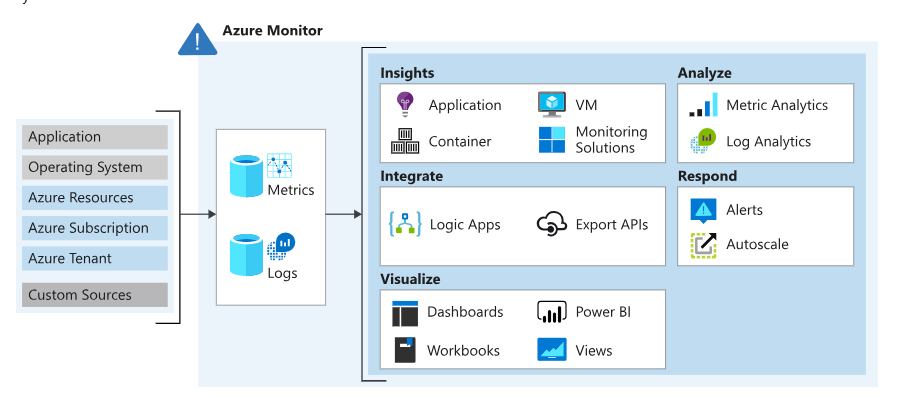
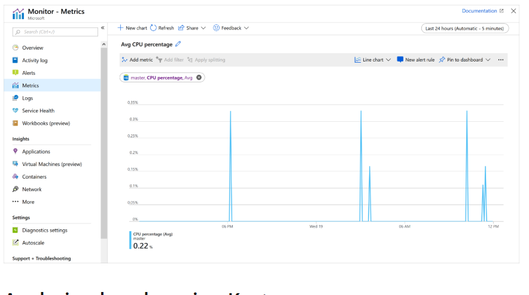
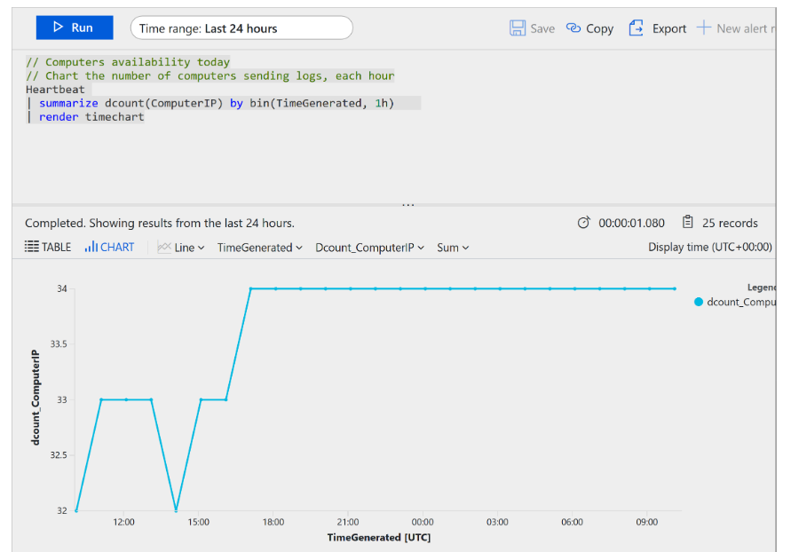
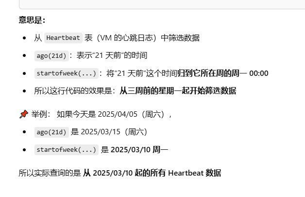
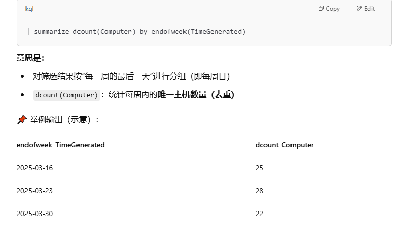

## Data types in Azure Monitor:



- metric: numerical time-sensitive values that represent some aspect of the target resource



- log: querying of content data held in structured, record-based log files that are relevant to the target resource




Three signal type you can use to monitor:
- **Metric alerts** provide an alert trigger when a specified threshold is exceeded. For example, a metric alert can notify you when CPU usage is greater than 95 percent.
- **Activity log alerts** notify you when Azure resources change state. For example, an activity log alert can notify you when a resource is deleted.
- **Log alerts** are based on things written to log files. For example, a log search alert can notify you when a web server returns a particular number of 404 or 500 responses.

## Kusto language
A Kusto query consists of a sequence of query statements delimited by a **semicolon (;)**. At least one statement is a tabular expression statement. **A tabular expressio** statement formats the data arranged as a table of columns and rows.

A tabular expression statement's syntax has a tabular data flow from one tabular query operator to another, starting with a data source. A data source might be a table in a database or an operator that produces data. The data then flows through a set of data-transformation operators that are bound together with the **pipe (|) delimiter.**

**Example:**
```kusto
Events
| where StartTime >= datetime(2018-11-01) and StartTime < datetime(2018-12-01)
| where State == "FLORIDA"  
| count
```
The following Kusto query has **a single tabular expression statement**. The statement starts with a reference to **a table called Events**. The database that hosts this table is implicit here, and is part of the connection information. The data for that table, **stored in rows**, is **filtered by the value of the StartTime column**. The data is filtered further by the value of the **State** column. The query then returns the count of the resulting rows.

```Kusto
Heartbeat
| summarize arg_max(TimeGenerated, *) by ComputerIP
```
The following example retrieves the most recent heartbeat record for each computer. The computer is identified by its IP address. In this example, the **summarize aggregation** with the **arg_max function** returns the record with the most recent value for each IP address.（返回Computer IP分组中TimeGenerated最大也就是最新的记录，*表示这条记录的所有列都要保存）

> summarize是类似SQL中的GROUP BY(聚合数据)，可以用它对日志进行计数（count()），求和（sum()），平均（avg()），最大/最小值（max() / min()），获取指定列下的最大行（arg_max()）

```Kusto
Heartbeat
    | where TimeGenerated >= startofweek(ago(21d))
    | summarize dcount(Computer) by endofweek(TimeGenerated) | render barchart kind=default
```





这条 KQL 查询展示了最近三周内每周有多少台 VM 报告了 Heartbeat（活跃），并用柱状图表示出来。