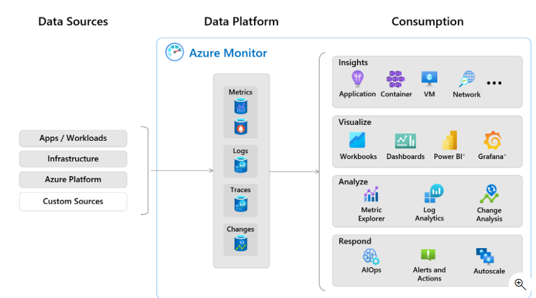
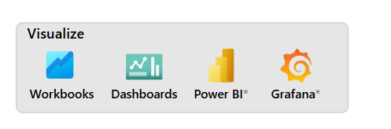

## high-level architectural view of Azure Monitor:

## Metrics
Metrics are quantitative measurements(
定量测量) that show snapshots of application or resource performance. Metrics are typically (numeric values数值) that you can measure over time.
- **Azure platform metrics:** Azure Monitor starts collecting metrics data from Azure resources as soon as they're added to a subscription. 
- **Custom metrics:**: You can send custom metrics to Azure Monitor via the Azure Monitor Agent, other agents and extensions, or directly to the Azure Monitor REST API.
- **Prometheus普罗米修斯 metrics:** Azure Monitor managed service for Prometheus collects metrics from Azure Kubernetes Service (AKS) or other Kubernetes clusters. Prometheus metrics share some characteristics with platform and custom metrics, but have different features to support open-source analysis and alerting tools like PromQL and Grafana.

## Logs
Once you configure the workspace and start logging data, you can use Azure Monitor Logs to explore and analyze the data. You can work with log queries and their results interactively in the Log Analytics user interface.

##  Insights
Some Azure resource providers have created visualizations that provide a customized monitoring experience and require minimal configuration. Insights are large, scalable, curated visualizations.
- **Application insight**:The Application Insights feature of Azure Monitor provides application performance monitoring (APM) from app development, through test, and into production
- **Container insight**:Container Insights gives you performance visibility into containerized workloads deployed to Azure Kubernetes Service (AKS) or Azure Container Instances.
- **VM insight**:VM Insights monitors and analyzes the performance and health of your Azure Windows and Linux VMs
- **Network insight**:Network Insights provides a comprehensive visual representation of health and metrics for all deployed network resources through topologies, without requiring any configuration

## Visualizations
- Workbooks
- Dashboards
- Power BI
- Grafana

## Actions
- **Aritificial Intelligence for IT Operations**: AIOps refers to the application of artificial intelligence and machine learning technologies to enhance and automate IT operations. It combines big data, analytics, and automation to help IT teams detect, diagnose, and resolve issues faster and more efficiently.
- **Azure Monitor alerts**
- **Autoscale**