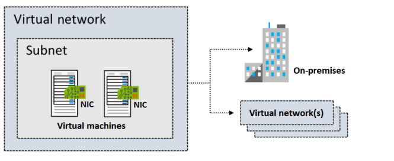
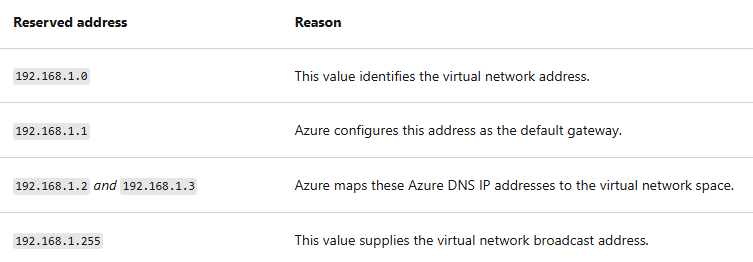

## Virtual networks
*Things to know about Vnet:*
- An Azure virtual network is a **logical isolation** of the Azure cloud resources.

- Each virtual network has its own **Classless Inter-Domain Routing (CIDR) block** and can be linked to other virtual networks and on-premises networks.

- You control the **DNS server settings** for virtual networks, and segmentation of the virtual network into subnets.

*Example of hybric network architecture:*

## Subnet
#### Reversed addresses in subnet

*things to know about subnet:*
- Consider network **virtual appliances**. Azure routes **network traffic between all subnets in a virtual network**, by default. You can **override Azure's default routing** to prevent Azure routing **between subnets**. You can also override the default to route traffic between subnets through a network virtual appliance. If you require traffic between resources in the same virtual network to flow through a network virtual appliance, deploy the resources to different subnets.

