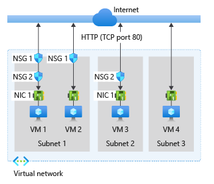
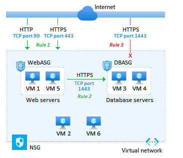

## Network security rules
*Things to know about NSG rules*:
- Azure creates several **default security rules** within each network security group, including inbound traffic and outbound traffic. Examples of default rules include ***DenyAllInbound*** traffic and ***AllowInternetOutbound*** traffic.

- You can add more security rules by specifying conditions as below:
    - Name
    - Priority
    - Port
    - Protocol (Any, TCP, UDP)
    - Source (Any, IP addresses, Service tag)
    - Destination (Any, IP addresses, Virtual network)
    - Action (Allow or Deny)

- For **inbound traffic**, Azure first processes network security group security rules for **any associated subnets** and then **any associated network interfaces**.
- For **outbound traffic**, the process is reversed. Azure first evaluates network security group security rules for **any associated network interfaces** followed by **any associated subnets**.

*Traffic flow between internet and VM*:

## Application security groups
*Traffic flow between internet and VM using application security groups*:

