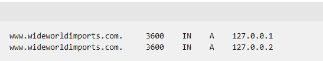
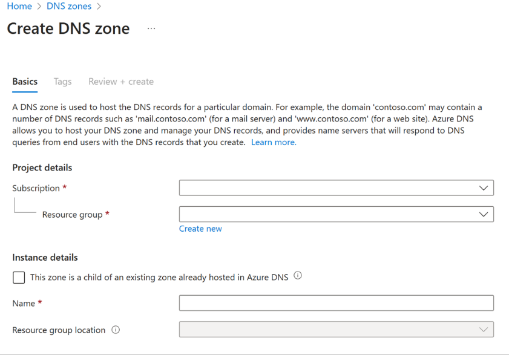
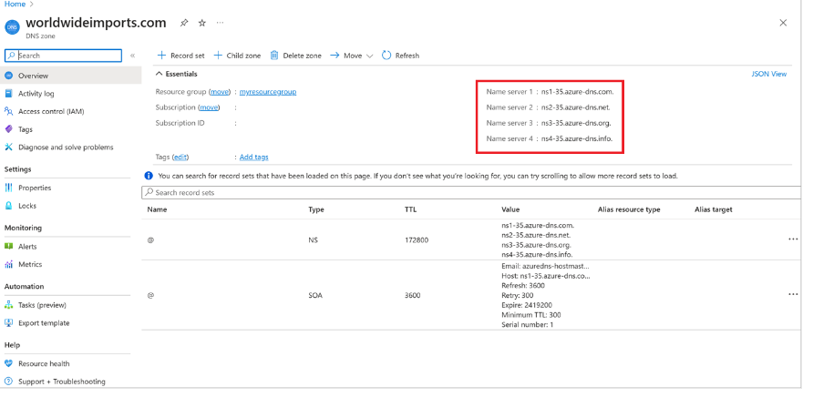
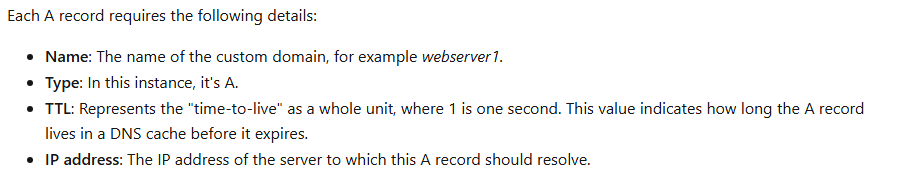
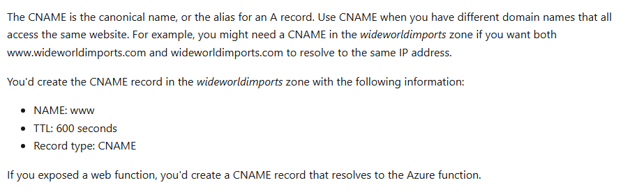
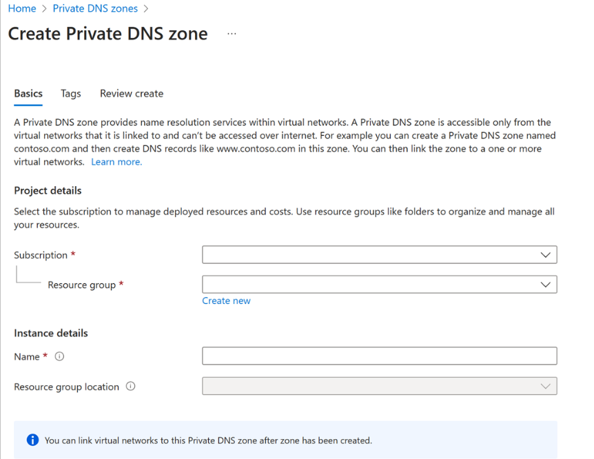
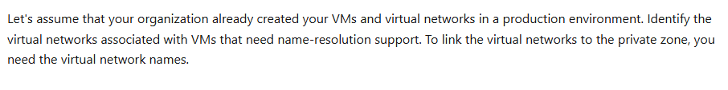
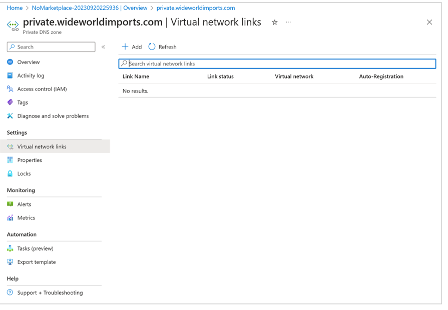
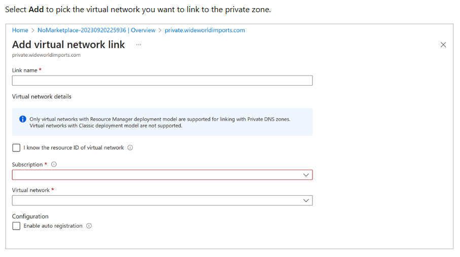

## DNS record types
**Configuration information** for your DNS server is stored **as a file** within a zone on your DNS server. **Each file is called a record**. The following record types are the most commonly created and used:

- **A** is the host record, and is the most common type of DNS record. It **maps the domain or host name** to the **IP address**.
- **CNAME** is a Canonical Name record that's used to **create an alias** from **one domain name** to **another domain name**. 
- **MX** is the **mail exchange record**. It maps mail requests to your mail server, whether hosted on-premises or in the cloud.
- **TXT** is the text record. It's used to **associate text strings** with **a domain name**. Azure and Microsoft 365 use TXT records to verify domain ownership.

Additionally, there are the following record types:

Wildcards
CAA (certificate authority)
NS (name server)
SOA (start of authority)
SPF (sender policy framework)
SRV (server locations)

> The SOA and NS records are created automatically when you create a DNS zone by using Azure DNS.

#### Record sets
Some record types support the concept of record sets, or resource record sets. A record set allows for multiple resources to be defined in a single record. For example, here's an A record that has one domain with two IP addresses:



## Public DNS zone:

1. **Create a public DNS zone in Azure:**
> You use a DNS zone to host the DNS records for a domain, such as wideworldimports.com.



2. **Get your Azure DNS name servers**:
> After you create a DNS zone for the domain, you need to get the name server details from the name servers (NS) record. You use these details to update your domain registrar's information and point to the Azure DNS zone.



3. ** Update the domain registrar setting**:
> As the domain owner, you need to sign in to the domain-management application provided by your domain registrar. In the management application, edit the NS record and change the NS details to match your Azure DNS name server details.

> Changing the NS details is called **domain delegation**. When you delegate the domain, you must use all four name servers provided by Azure DNS.

4. **Verify delegation of domain name services**:
To verify the delegation, use nslookup like this:
```dos
nslookup -type=SOA wideworldimports.com
```

5. **Configure your custom DNS settings**:

**A record**:



**CNAME record**:



## Private DNS zone:
> Private DNS zones aren't visible on the Internet, and don't require that you use a **domain registrar**.
1. **Create a private DNS zone:**



2. **Identify virtual networks**:



3. **Link your virtual network to a private DNS zone**:



