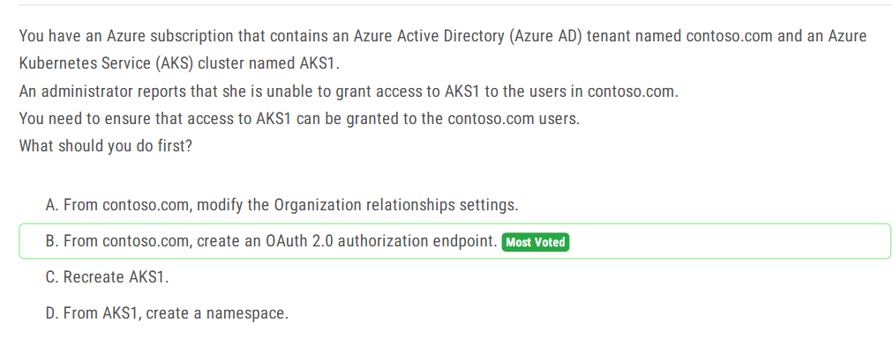

\#30题: 

答案：enable Floating IP
floating IP是后端VM直接返回对话给用户端，绕过DNS服务器
> 以及DNS server另一个模式Session Persistence，可以保证同一个客户端始终打开相同的后端VM，保证内存中的session一致性不丢失

\38题：

1. New-AzureADUser 是用来创建Azure AD users的，而-New-AzureADMSInvitation是用来创建guest users account的
2. 如果是按键的话 Bulk create是用来创建Azure AD users的，而Bulk invite user是用来创建guest users account的

\42题：

aks与open ID connect:

\43题：

entra ID中security group和Microsoft O365 group:

